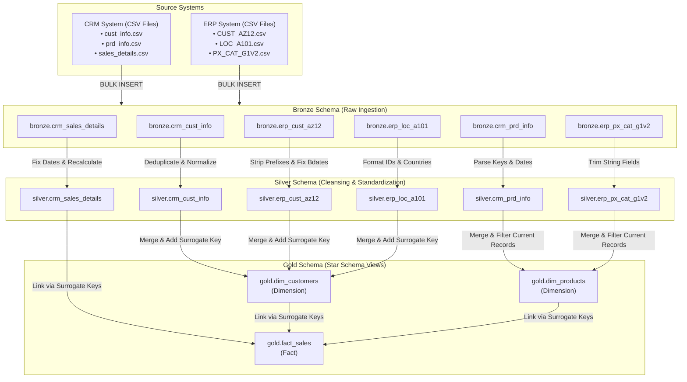

# Modern SQL Data Warehouse & ETL Pipeline

[](https://www.microsoft.com/sql-server)
[-blue.svg)](#data-warehouse-architecture)
[](https://docs.microsoft.com/sql/t-sql/)
[](LICENSE)

An enterprise-grade Data Warehouse solution built on **Microsoft SQL Server** using the **Medallion Architecture** pattern (Bronze, Silver, and Gold layers). This project ingests raw data from disparate source systems (CRM & ERP), cleanses and standardizes the data, and transforms it into a business-ready **Star Schema** for analytical querying and reporting.

---

## Table of Contents

- [Overview](#overview)
- [Data Warehouse Architecture](#data-warehouse-architecture)
- [Data Sources & Schema Mapping](#data-sources--schema-mapping)
- [Repository Structure](#repository-structure)
- [Getting Started & Setup Guide](#getting-started--setup-guide)
  - [Prerequisites](#prerequisites)
  - [Step 1: Database & Schema Creation](#step-1-database--schema-creation)
  - [Step 2: Bronze Layer (Raw Ingestion)](#step-2-bronze-layer-raw-ingestion)
  - [Step 3: Silver Layer (Cleansing & Transformation)](#step-3-silver-layer-cleansing--transformation)
  - [Step 4: Gold Layer (Analytical Star Schema)](#step-4-gold-layer-analytical-star-schema)
- [Data Quality & Verification](#data-quality--verification)
- [Sample Business Queries](#sample-business-queries)
- [License](#license)

---

## Overview

This repository demonstrates the end-to-end design and implementation of a SQL-based Data Warehouse pipeline. It addresses real-world data engineering challenges such as:
- **Multi-Source Data Integration**: Combining data from Customer Relationship Management (CRM) and Enterprise Resource Planning (ERP) systems.
- **Data Cleansing & Normalization**: Handling NULLs, duplicate records, structural inconsistencies, whitespace padding, invalid dates, and out-of-range values.
- **Dimensional Modeling**: Structuring analytics data into a Star Schema with Conformed Dimensions (`dim_customers`, `dim_products`) and a Fact Table (`fact_sales`).
- **Data Quality Framework**: Automated quality checks to validate primary keys, surrogate key uniqueness, calculation accuracy, and referential integrity.

---

## Data Warehouse Architecture

The architecture follows the **Medallion Architecture** design pattern:



### Architectural Layers

| Layer | Schema | Description | Ingestion Method / Logic |
| :--- | :--- | :--- | :--- |
| **Bronze** | `bronze` | **Raw Ingestion**: Stores un-transformed source data as-is from CSV files. | Truncate & Reload via `BULK INSERT` in stored procedure `bronze.load_bronze`. |
| **Silver** | `silver` | **Cleansed & Standardized**: Cleaned, deduplicated, and transformed data ready for modeling. | Stored procedure `silver.load_silver` performs TRIM, CASE normalization, date parsing, invalid value correction, and adds `dwh_create_date`. |
| **Gold** | `gold` | **Business-Ready (Star Schema)**: Dimension views and Fact views populated for BI and Analytics. | Views (`dim_customers`, `dim_products`, `fact_sales`) combining Silver entities with surrogate keys (`ROW_NUMBER()`). |

---

## Data Sources & Schema Mapping

The warehouse integrates data from two primary domain systems:

### 1. CRM System (`datasets/source_crm/`)
- `cust_info.csv` $\rightarrow$ `bronze.crm_cust_info` $\rightarrow$ `silver.crm_cust_info`: Customer demographics, marital status, gender, and creation date.
- `prd_info.csv` $\rightarrow$ `bronze.crm_prd_info` $\rightarrow$ `silver.crm_prd_info`: Product catalog details, product line codes, costs, start and end dates.
- `sales_details.csv` $\rightarrow$ `bronze.crm_sales_details` $\rightarrow$ `silver.crm_sales_details`: Sales order line items, order dates, ship dates, due dates, quantities, and prices.

### 2. ERP System (`datasets/source_erp/`)
- `CUST_AZ12.csv` $\rightarrow$ `bronze.erp_cust_az12` $\rightarrow$ `silver.erp_cust_az12`: Additional customer details (birthdates, gender codes).
- `LOC_A101.csv` $\rightarrow$ `bronze.erp_loc_a101` $\rightarrow$ `silver.erp_loc_a101`: Customer geographical location and country mapping.
- `PX_CAT_G1V2.csv` $\rightarrow$ `bronze.erp_px_cat_g1v2` $\rightarrow$ `silver.erp_px_cat_g1v2`: Product categories, subcategories, and maintenance flags.

---

## Repository Structure

```directory
sql_data_warehouse_project/
├── LICENSE                              # Open-source license (MIT)
├── README.md                            # Project documentation
├── datasets/                            # Raw data CSV files
│   ├── source_crm/                      # CRM Source Files
│   │   ├── cust_info.csv
│   │   ├── prd_info.csv
│   │   └── sales_details.csv
│   └── source_erp/                      # ERP Source Files
│       ├── CUST_AZ12.csv
│       ├── LOC_A101.csv
│       └── PX_CAT_G1V2.csv
├── docs/                                # Documentation assets
├── scripts/                             # DDL and Stored Procedure scripts
│   ├── init_database.sql                # Database & schema creation script
│   ├── bronze/                          # Bronze layer scripts
│   │   ├── ddl_bronze_sql               # DDL for raw tables
│   │   └── stored_procedure_load_bronze.sql  # Ingestion ETL procedure
│   ├── silver/                          # Silver layer scripts
│   │   ├── ddl_silver.sql               # DDL for cleansed tables
│   │   └── stored_procedure_load_silver.sql  # Cleansing ETL procedure
│   └── gold/                            # Gold layer scripts
│       └── ddl_gold.sql                 # DDL for Star Schema views
└── tests/                               # Data quality testing scripts
    ├── quality_checks_silver.sql        # Silver layer validation queries
    └── quality_checks_gold.sql          # Gold layer integrity & relationship checks
```

---

## Getting Started & Setup Guide

### Prerequisites
- **Microsoft SQL Server** (2016 or newer / Developer / Express Edition)
- **SQL Server Management Studio (SSMS)** or **Azure Data Studio**
- File system access to the local path containing the raw CSV datasets.

---

### Step 1: Database & Schema Creation

Execute [init_database.sql](file:///c:/Users/PRAGYAN/sql_data_warehouse_project-main/scripts/init_database.sql) in SQL Server to drop any pre-existing database named `DataWarehouse` and initialize a fresh database with three dedicated schemas (`bronze`, `silver`, `gold`):

```sql
-- Run scripts/init_database.sql
USE master;
GO
EXEC scripts/init_database.sql;
```

---

### Step 2: Bronze Layer (Raw Ingestion)

1. Create the Bronze schema tables by running [ddl_bronze_sql](file:///c:/Users/PRAGYAN/sql_data_warehouse_project-main/scripts/bronze/ddl_bronze_sql).
2. Create and execute the stored procedure [stored_procedure_load_bronze.sql](file:///c:/Users/PRAGYAN/sql_data_warehouse_project-main/scripts/bronze/stored_procedure_load_bronze.sql) to bulk insert CSV datasets into the Bronze tables:

> [!NOTE]
> Update the file paths inside `stored_procedure_load_bronze.sql` to match your local dataset folder directory before running.

```sql
-- Execute Bronze DDL
-- Execute scripts/bronze/ddl_bronze_sql

-- Create and run the load procedure
EXEC bronze.load_bronze;
```

---

### Step 3: Silver Layer (Cleansing & Transformation)

1. Create the Silver schema tables by running [ddl_silver.sql](file:///c:/Users/PRAGYAN/sql_data_warehouse_project-main/scripts/silver/ddl_silver.sql).
2. Create and execute the ETL stored procedure [stored_procedure_load_silver.sql](file:///c:/Users/PRAGYAN/sql_data_warehouse_project-main/scripts/silver/stored_procedure_load_silver.sql):

```sql
-- Execute Silver DDL
-- Execute scripts/silver/ddl_silver.sql

-- Run Silver ETL transformation pipeline
EXEC silver.load_silver;
```

#### Key Transformations Applied in Silver Layer:
- **Customer Deduplication**: Retains the latest record per customer (`ROW_NUMBER() PARTITION BY cst_id ORDER BY cst_create_date DESC`).
- **Data Standardizations**: Converts gender codes ('M', 'F') to 'Male'/'Female' and marital status ('S', 'M') to 'Single'/'Married'.
- **Key Extraction**: Derives `cat_id` and clean `prd_key` from string column `prd_key`.
- **SCD Type 2 End-Date Calculation**: Uses `LEAD()` window function to compute effective product expiration dates (`prd_end_dt`).
- **Data Integrity Checks**: Converts integer YYYYMMDD dates to SQL `DATE` types, recalculates corrupted sales metrics (`sales = quantity * price`), and derives missing unit prices.

---

### Step 4: Gold Layer (Analytical Star Schema)

Create the business reporting layer by running [ddl_gold.sql](file:///c:/Users/PRAGYAN/sql_data_warehouse_project-main/scripts/gold/ddl_gold.sql):

```sql
-- Create Gold Views (Star Schema)
-- Execute scripts/gold/ddl_gold.sql
```

#### Gold Layer Schema Definitions:

##### 1. `gold.dim_customers` (Dimension View)
- `customer_key` (INT, Surrogate Key)
- `customer_id`, `customer_number`
- `first_name`, `last_name`
- `country` (Joined from `silver.erp_loc_a101`)
- `marital_status`, `gender` (Consolidated from CRM with ERP fallback)
- `birthdate`, `create_date`

##### 2. `gold.dim_products` (Dimension View)
- `product_key` (INT, Surrogate Key)
- `product_id`, `product_number`, `product_name`
- `category_id`, `category`, `subcategory`, `maintenance` (Joined from `silver.erp_px_cat_g1v2`)
- `cost`, `product_line`, `start_date`
- *Filter*: Active records only (`prd_end_dt IS NULL`).

##### 3. `gold.fact_sales` (Fact View)
- `order_number`
- `product_key` (Foreign Key $\rightarrow$ `gold.dim_products.product_key`)
- `customer_key` (Foreign Key $\rightarrow$ `gold.dim_customers.customer_key`)
- `order_date`, `shipping_date`, `due_date`
- `sales_amount`, `quantity`, `price`

---

## Data Quality & Verification

Automated SQL test scripts are included under the `tests/` directory to guarantee data reliability:

1. **Silver Quality Checks** ([quality_checks_silver.sql](file:///c:/Users/PRAGYAN/sql_data_warehouse_project-main/tests/quality_checks_silver.sql)):
   - Primary key uniqueness & non-null constraints.
   - Whitespace padding detection (`WHERE col != TRIM(col)`).
   - Date range validation (e.g. `order_date <= ship_date`, birthdate within valid historical range).
   - Value consistency (`sales_amount == quantity * price`).

2. **Gold Quality Checks** ([quality_checks_gold.sql](file:///c:/Users/PRAGYAN/sql_data_warehouse_project-main/tests/quality_checks_gold.sql)):
   - Uniqueness check for surrogate keys (`customer_key`, `product_key`).
   - Referential integrity checks ensuring 100% join match between `fact_sales` and dimension views (`dim_customers`, `dim_products`).

---

## Sample Business Queries

Once the Gold layer views are built, you can query the Star Schema directly for business insights:

### Query 1: Total Revenue and Orders by Country
```sql
SELECT 
    c.country,
    COUNT(DISTINCT f.order_number) AS total_orders,
    SUM(f.sales_amount) AS total_revenue
FROM gold.fact_sales f
JOIN gold.dim_customers c ON f.customer_key = c.customer_key
GROUP BY c.country
ORDER BY total_revenue DESC;
```

### Query 2: Sales Performance by Product Category
```sql
SELECT 
    p.category,
    p.subcategory,
    SUM(f.quantity) AS total_units_sold,
    SUM(f.sales_amount) AS total_revenue
FROM gold.fact_sales f
JOIN gold.dim_products p ON f.product_key = p.product_key
GROUP BY p.category, p.subcategory
ORDER BY total_revenue DESC;
```

---

## License

This project is licensed under the MIT License - see the [LICENSE](LICENSE) file for details.
